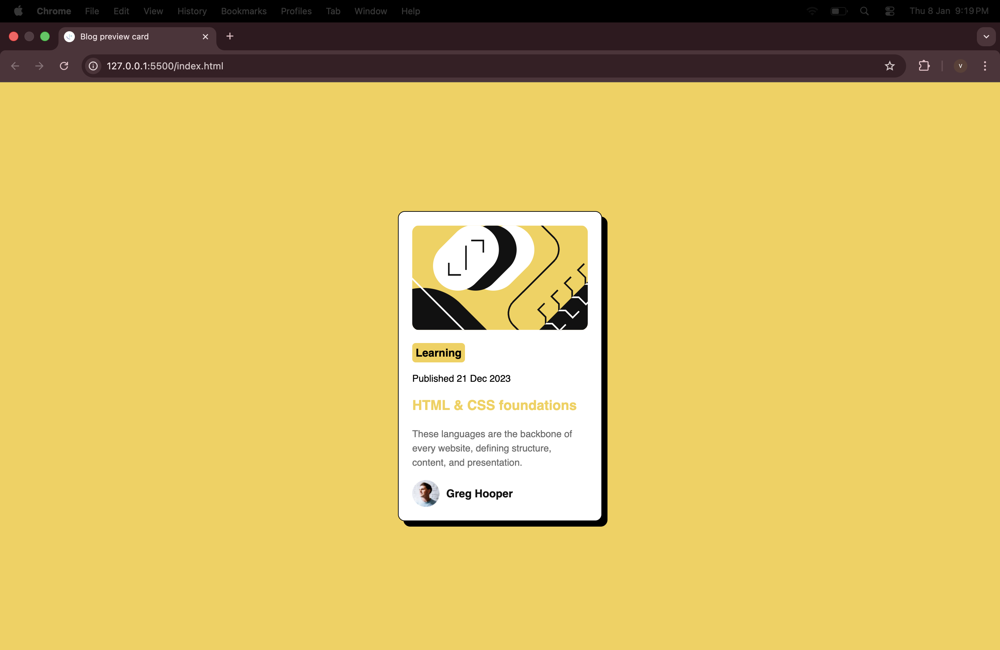

# Frontend Mentor - Blog preview card solution

This is a solution to the [Blog preview card challenge on Frontend Mentor](https://www.frontendmentor.io/challenges/blog-preview-card-ckPaj01IcS). Frontend Mentor challenges help you improve your coding skills by building realistic projects. 

## Table of contents

- [Overview](#overview)
   - [Screenshot](#screenshot)
  - [Links](#links)
- [My process](#my-process)
  - [Built with](#built-with)
  - [What I learned](#what-i-learned)
 - [Author](#author)
 
## Overview


### Screenshot




### Links

- Solution URL: [Github Repo Link](https://github.com/vinniit-23/Blog-preview-card)
- Live Site URL: [Site Url](https://vinniit-23.github.io/Blog-preview-card/)

## My process

### Built with

- Semantic HTML5 markup
- CSS custom properties
- Flexbox
- CSS Grid
- Mobile-first workflow


### What I learned

I learned more About HTML5 and CSS properties which helped me to 
complete this project, And also enjoyed the development and deployment
process.

```html
  <main id="Blogpost-card">
      <article>
        

        <header class="post-header">
          <span>Learning</span>

          <p>Published 21 Dec 2023</p>

          <h1>HTML & CSS foundations</h1>
        </header>
        <p class="post-text">
          These languages are the backbone of every website, defining structure,
          content, and presentation.
        </p>

        <footer class="footer">
          
          <p>Greg Hooper</p>
        </footer>
      </article>
    </main>
```
```css
main {
  display: flex;
  flex-direction: column;
  height: auto;
  max-width: 300px;
  background-color: hsl(0, 0%, 100%);
  padding: 20px;
  border-radius: 10px;
  border: 1px solid black;
  box-shadow: 8px 8px 0 #000;
  gap: 10px;
}
```


## Author

- Frontend Mentor - [@vinniit-23](https://www.frontendmentor.io/profile/vinniit-23)
- X - [@vinniit_23](https://x.com/vinniit_23)

 